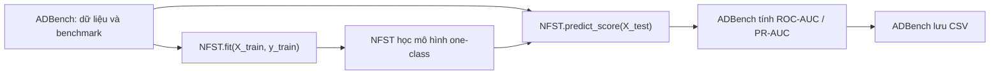
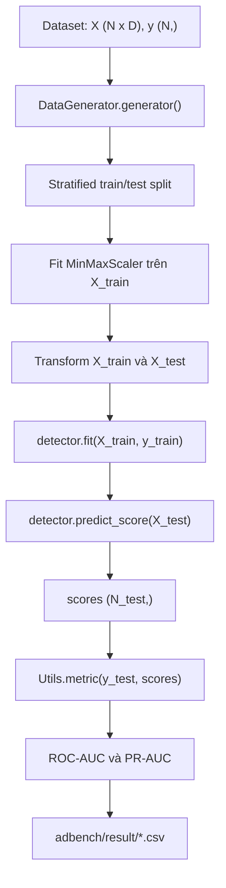
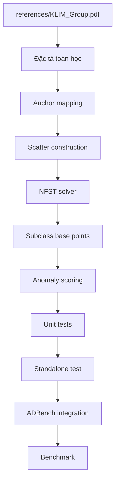
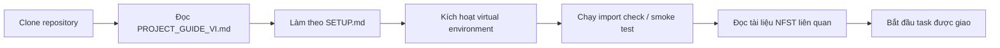

# Hướng dẫn dự án ADBench - NFST

Tài liệu này giúp thành viên mới hiểu dự án, thiết lập môi trường và tìm đúng tài liệu trước khi sửa mã. Đây là bản hướng dẫn nhập môn; công thức chi tiết và quy tắc kỹ thuật vẫn nằm trong các tài liệu nguồn được liên kết bên dưới.

## 1. Tổng quan dự án

### ADBench là gì?

ADBench là framework benchmark cho các thuật toán phát hiện bất thường trên dữ liệu dạng bảng. Framework chuẩn hóa các bước chung như tải dữ liệu, chia tập train/test, scale đặc trưng, gọi detector, tính ROC-AUC và PR-AUC, đo thời gian và lưu kết quả CSV.

Mục tiêu chính là so sánh nhiều detector dưới cùng một quy trình. Vì vậy, không nên tự ý thay đổi cách chia dữ liệu, metric hoặc định dạng kết quả cho riêng một thuật toán.

### NFST là gì?

NFST (Anchor-based Kernelized One-Class LPP-NFST) là detector one-class độc lập đã được triển khai cho dự án này. Ý tưởng chính gồm:

- học biểu diễn của dữ liệu normal;
- tạo anchor bằng MiniBatch K-Means;
- ánh xạ dữ liệu sang không gian anchor bằng Gaussian similarity;
- xây dựng scatter matrix theo công thức NFST;
- tìm không gian chiếu NFST;
- tạo base point cho các pseudo-subclass;
- dùng khoảng cách tới base point gần nhất làm anomaly score.

Phần standalone, solver, base point, scoring và adapter mỏng đã hoàn thành. NFST đã được đăng ký trong nhóm unsupervised của `RunPipeline` và đã qua pipeline smoke test tổng hợp; benchmark trên dữ liệu thực chưa bắt đầu.

### Quan hệ giữa ADBench và NFST



ADBench chịu trách nhiệm về pipeline benchmark. NFST chỉ chịu trách nhiệm học mô hình và trả về một anomaly score cho mỗi mẫu test. Score càng lớn phải có nghĩa là mẫu càng bất thường.

## 2. Cấu trúc repository

Ký hiệu:

- **[ADBench gốc]**: mã hoặc tài nguyên có từ repository ADBench ban đầu.
- **[Bổ sung NFST]**: tài liệu, tham chiếu hoặc công cụ được thêm cho dự án NFST.
- **[Cục bộ]**: được tạo trên máy lập trình viên, không được commit.

```text
ADBench/
|-- adbench/                              [ADBench gốc]
|   |-- run.py                            [ADBench gốc]
|   |-- myutils.py                        [ADBench gốc]
|   |-- datasets/                         [ADBench gốc]
|   |-- baseline/                         [ADBench gốc]
|   |   `-- NFST/                         [Bổ sung NFST - mã standalone]
|   |       |-- __init__.py
|   |       |-- anchor_mapping.py
|   |       |-- model.py
|   |       |-- run.py
|   |       |-- scatter.py
|   |       |-- scoring.py
|   |       `-- solver.py
|   `-- result/                           [Kết quả runtime, không commit]
|-- docs/                                 [Bổ sung NFST / knowledge base]
|   |-- architecture.md
|   |-- detector_contract.md
|   |-- dependency_audit.md
|   |-- implementation_status.md
|   |-- nfst_algorithm_spec.md
|   |-- nfst_implementation_plan.md
|   |-- nfst_test_plan.md
|   `-- nfst_workflow.md
|-- references/                           [Bổ sung NFST]
|   `-- KLIM_Group.pdf
|-- scripts/                              [Bổ sung NFST]
|   |-- setup.ps1
|   `-- smoke_test_nfst.py
|-- figs/                                 [ADBench gốc]
|-- AGENTS.md                             [Bổ sung NFST]
|-- SETUP.md                              [Bổ sung NFST]
|-- PROJECT_GUIDE_VI.md                   [Bổ sung NFST]
|-- README.md                             [ADBench gốc]
|-- guidance.ipynb                        [ADBench gốc]
|-- requirements.txt                      [ADBench gốc]
|-- setup.py                              [ADBench gốc]
|-- .gitignore                            [Quản lý Git; phải loại file cục bộ/output]
`-- .venv/                                [Cục bộ; không thuộc source, không commit]
```

Lưu ý: môi trường đã được xác minh trong `SETUP.md` nằm tại `C:\Users\Admin\.venvs\adbench-smoke-py310`, bên ngoài repository. Tên `.venv/` trong cây trên biểu diễn lựa chọn môi trường cục bộ phổ biến của thành viên; không được coi là mã dự án.

## 3. Vai trò của các file và thư mục quan trọng

| Đường dẫn | Mục đích | Lưu ý khi làm việc |
|---|---|---|
| `adbench/` | Python package chính của ADBench. | Là mã benchmark cốt lõi; sửa thận trọng. |
| `adbench/run.py` | Chứa `RunPipeline`, tạo thí nghiệm, chọn detector, đo thời gian, tính metric và lưu CSV. | Gần như không sửa nếu chỉ thêm NFST. Không đổi public API hoặc benchmark behavior. |
| `adbench/myutils.py` | Seeding, metric, sampling, download, plotting và tiện ích chung. | `Utils.metric()` là định nghĩa metric chung; không sửa cho riêng NFST. |
| `adbench/datasets/` | Dataset `.npz`, `DataGenerator`, chia train/test, scale và xử lý mức độ cung cấp label. | Không sửa dataset hoặc logic split/scale nếu không có yêu cầu benchmark-wide. |
| `adbench/baseline/` | Các baseline unsupervised, semi-supervised, supervised và deep learning. | Không sửa baseline không liên quan. Mã NFST nằm trong `adbench/baseline/NFST/`. |
| `docs/` | Knowledge base kỹ thuật, trạng thái, thiết kế NFST và kế hoạch test. | Đọc trước khi quét hoặc sửa source. |
| `references/` | Tài liệu nghiên cứu dùng làm nguồn tham chiếu. | `KLIM_Group.pdf` là nguồn công thức cuối cùng của NFST. |
| `scripts/` | Script hỗ trợ tái tạo môi trường hoặc thao tác dự án. | `setup.ps1` tạo đúng môi trường đã xác minh. |
| `figs/` | Hình minh họa của ADBench. | Tài nguyên gốc; không liên quan trực tiếp tới NFST core. |
| `AGENTS.md` | Quy tắc cho coding agent và người thực hiện thay đổi. | Đọc trước mọi task chỉnh sửa. |
| `SETUP.md` | Python/package pin, lệnh cài đặt, kiểm tra import và smoke-test đã xác minh. | Là hướng dẫn chuẩn khi môi trường lỗi. |
| `README.md` | Giới thiệu và hướng dẫn sử dụng ADBench gốc. | Hữu ích để hiểu framework ở mức người dùng. |
| `guidance.ipynb` | Notebook hướng dẫn chạy ADBench và custom detector. | Dùng để học luồng sử dụng, không phải nguồn công thức NFST. |
| `requirements.txt` | Dependency khai báo bởi ADBench gốc. | Nhiều package không pin; dùng `SETUP.md` để tái tạo môi trường đã test. |
| `setup.py` | Metadata package và `install_requires`. | Không đổi dependency hoặc metadata nếu task không yêu cầu. |
| `.gitignore` | Quy định file không đưa vào Git. | Phải loại `.venv/`, cache, model tạm và output benchmark. Nếu chưa có rule phù hợp, trao đổi trước khi sửa. |
| `.venv/` | Virtual environment cục bộ nếu nhóm chọn đặt trong repository. | Không commit. Môi trường chuẩn hiện dùng đường dẫn ngoài repository theo `SETUP.md`. |

## 4. Quy trình thực thi ADBench



Các điểm cần nhớ:

- Split mặc định dùng test size 30% và stratify theo label.
- Scaler chỉ fit trên `X_train`; `X_test` chỉ được transform.
- Ở chế độ unsupervised, anomaly chưa được gắn nhãn có thể vẫn nằm trong `X_train` nhưng `y_train` của chúng bị đổi thành `0`.
- `fit()` phải trả về `self`.
- `predict_score()` phải trả vector một chiều có đúng một score cho mỗi mẫu.
- Score lớn hơn phải biểu diễn mức bất thường cao hơn.
- ADBench tính metric và lưu bốn nhóm CSV: ROC-AUC, PR-AUC, fit time và inference time.

## 5. Quy trình phát triển NFST



Trình tự bắt buộc:

1. Đọc paper và `docs/nfst_algorithm_spec.md`.
2. Đối chiếu các quyết định đã chốt trong `docs/nfst_algorithm_spec.md` với PDF.
3. Cố định một ví dụ ma trận nhỏ có kết quả tham chiếu.
4. Làm anchor mapping và kiểm tra `Z` hữu hạn, không âm, mỗi hàng có tổng xấp xỉ `1`.
5. Làm scatter matrix đúng công thức đã được duyệt.
6. Làm NFST solver và test theo subspace, không so sánh dấu eigenvector trực tiếp.
7. Tạo pseudo-subclass, base point và anomaly score.
8. Chạy unit test rồi standalone synthetic test.
9. Giữ adapter ADBench mỏng; NFST chỉ được đăng ký trong nhóm unsupervised.
10. Dùng `scripts/smoke_test_nfst.py` cho smoke test một-model; benchmark nhiều dataset cần task riêng.

Không được tự thay công thức Laplacian, scatter kết hợp global/local hoặc bài toán eigenvalue đã chốt từ PDF.

## 6. Quy trình onboarding thành viên mới



### Các bước thực tế

1. Clone repository và mở PowerShell tại thư mục gốc.
2. Đọc tài liệu này để hiểu ranh giới giữa ADBench và NFST.
3. Chạy `scripts/setup.ps1` theo [SETUP.md](SETUP.md).
4. Kích hoạt môi trường đã tạo:

   ```powershell
   & 'C:\Users\Admin\.venvs\adbench-smoke-py310\Scripts\Activate.ps1'
   ```

   Nếu nhóm chủ động dùng `.venv/`, hãy kích hoạt bằng `.\.venv\Scripts\Activate.ps1`; không commit thư mục này. Môi trường tham chiếu chính thức vẫn là đường dẫn trong `SETUP.md`.

5. Chạy `python -m pip check` và các import check trong `SETUP.md`.
6. Chạy smoke test Isolation Forest đã được nhóm phê duyệt. Xác nhận score/metric hữu hạn và CSV xuất hiện trong `adbench/result/`.
7. Đọc `docs/nfst_algorithm_spec.md`, `docs/nfst_implementation_plan.md` và phần test tương ứng với task.
8. Chỉ chỉnh file thuộc phạm vi task. Không kết hợp refactor ngoài phạm vi.

## 7. Quy tắc nguồn sự thật

Thứ tự ưu tiên cho NFST:

1. `references/KLIM_Group.pdf` là nguồn cuối cùng cho công thức NFST.
2. `docs/nfst_algorithm_spec.md` là bản chuyển công thức thành đặc tả kỹ thuật, shape và chính sách số học.
3. Nếu đặc tả và paper mâu thuẫn, dừng triển khai, ghi rõ khác biệt và yêu cầu quyết định. Không tự chọn công thức.
4. `docs/nfst_workflow.md` chỉ tóm tắt luồng; không thay thế đặc tả toán học.
5. `docs/nfst_implementation_plan.md` ghi cấu trúc mã standalone và cổng kiểm tra trước khi tích hợp ADBench.

Đối với ADBench, `RunPipeline`, `DataGenerator` và `Utils.metric()` là phần hành vi benchmark cốt lõi. Không thay đổi tùy tiện để làm NFST dễ tích hợp hơn. Adapter NFST phải tuân theo framework, không ép framework thay đổi theo NFST nếu chưa có lý do benchmark-wide.

## 8. Quy tắc Git

- Không commit `.venv/` hoặc bất kỳ virtual environment nào.
- Không commit `__pycache__/`, `.pytest_cache/`, file cache, file tạm hoặc log cục bộ.
- Không commit output benchmark trong `adbench/result/` nếu nhóm chưa yêu cầu lưu artifact cụ thể.
- Không sửa hoặc format lại baseline không liên quan.
- Giữ toàn bộ mã NFST cô lập trong `adbench/baseline/NFST/`.
- Mỗi commit chỉ nên giải quyết một mục rõ ràng và có test tương ứng.
- Không commit thay đổi dependency ngoài task thiết lập môi trường được phê duyệt.
- Không sửa public API, split, scaling, metric hoặc CSV schema mà không có giải thích và regression test.
- Trước khi commit, kiểm tra diff để chắc chắn không có dataset, model artifact, cache hoặc output ngoài ý muốn.

## 9. Tôi nên đọc file nào?

| Khi gặp vấn đề | Đọc trước | Mục đích |
|---|---|---|
| Cài đặt hoặc import lỗi | `SETUP.md`, sau đó `docs/dependency_audit.md` | Phiên bản chính xác, lệnh cài đặt và lịch sử tương thích. |
| Không hiểu kiến trúc | `docs/architecture.md` | Thành phần và trách nhiệm của pipeline. |
| Không rõ detector phải có API gì | `docs/detector_contract.md` | Constructor, `fit()`, `predict_score()`, shape và score convention. |
| Dependency hoặc eager import | `docs/dependency_audit.md` | Phân biệt dependency thật, framework overhead và deep model. |
| Không rõ ADBench chạy theo thứ tự nào | `docs/architecture.md` | Luồng dataset đến metric và CSV. |
| Công thức NFST | `references/KLIM_Group.pdf`, rồi `docs/nfst_algorithm_spec.md` | Nguồn toán học và đặc tả kỹ thuật. |
| Chuẩn bị triển khai NFST | `docs/nfst_implementation_plan.md` | Module, API, giai đoạn, rủi ro và rollback. |
| Viết hoặc review test NFST | `docs/nfst_test_plan.md` | Unit, synthetic, ablation và reliability tests. |
| Xem luồng NFST nhanh | `docs/nfst_workflow.md` | Sơ đồ train, inference và tích hợp ADBench. |
| Xem tiến độ dự án | `docs/implementation_status.md` | Hạng mục đã hoàn thành và chưa bắt đầu. |
| Không rõ quy tắc chỉnh sửa | `AGENTS.md` | Phạm vi, file nhạy cảm và coding rules. |

## 10. Checklist ngắn trước khi bắt đầu task

- [ ] Tôi đã đọc tài liệu đúng với task.
- [ ] Môi trường là Python 3.10.11 và `pip check` pass.
- [ ] Tôi hiểu input/output shape của phần mình làm.
- [ ] Công thức liên quan không còn quyết định blocking chưa giải quyết.
- [ ] Tôi không sửa ADBench core hoặc baseline ngoài phạm vi.
- [ ] Tôi có test và tiêu chí hoàn thành rõ ràng.
- [ ] Tôi sẽ không commit `.venv`, cache hoặc output benchmark.
