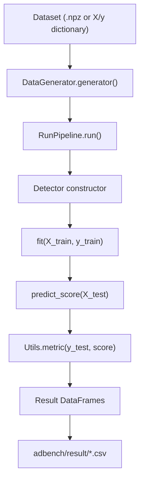
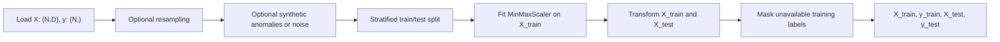
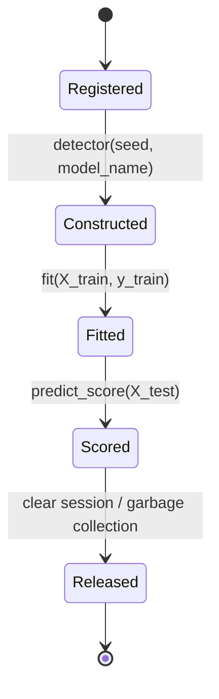

# ADBench Architecture

## Directory overview

| Path | Responsibility |
|---|---|
| `adbench/run.py` | Builds experiment grids, selects detector families, coordinates training and evaluation, and saves results. |
| `adbench/datasets/data_generator.py` | Discovers and loads datasets, applies sampling and corruption settings, splits data, scales features, and controls training-label visibility. |
| `adbench/myutils.py` | Provides seeding, metrics, downloading, sampling, plotting, and result-analysis utilities. |
| `adbench/baseline/PyOD.py` | Adapts PyOD detectors to the ADBench detector interface. |
| `adbench/baseline/Customized/` | Demonstrates the interface for a user-supplied detector. |
| `adbench/baseline/*/` | Contains supervised, semi-supervised, and deep baseline implementations. |
| `adbench/datasets/*/` | Stores classical datasets and precomputed CV/NLP embeddings as `.npz` files. |
| `adbench/result/` | Runtime-created destination for metric and timing CSV files. |

## Pipeline overview

`RunPipeline` is the coordinator. Data policy remains in `DataGenerator`, detector-specific behavior remains behind a small adapter interface, and metric calculation remains centralized in `Utils.metric`.

## Dataset lifecycle

`DataGenerator.generator()` loads `X` and `y` from a repository dataset or accepts a supplied dictionary through `RunPipeline.run()`. Small datasets may be resampled to the configured threshold and large datasets may be subsampled. The default split is stratified with a 30% test set. Scaling is fitted only on training features. Training anomaly labels are then exposed or masked according to the experiment's labeled-anomaly setting; test labels remain ground truth.

## Detector lifecycle

Built-in detectors are registered in `RunPipeline.model_dict`. A user detector can instead be passed through `RunPipeline.run(clf=...)`. `RunPipeline.model_fit()` constructs the adapter, measures fitting and inference time, requests test scores, evaluates them, then releases the detector.

## Evaluation lifecycle

`Utils.metric()` receives binary `y_test` and a one-dimensional anomaly-score vector. It calculates:

- ROC-AUC with `sklearn.metrics.roc_auc_score`;
- PR-AUC as average precision with `sklearn.metrics.average_precision_score`.

Anomaly label `1` is the positive class. Larger detector scores must indicate greater anomaly likelihood.

## Result generation

`RunPipeline.run()` maintains four DataFrames indexed by experiment parameters:

- ROC-AUC;
- PR-AUC;
- fitting time;
- inference time.

After each model execution, the DataFrames are written to `adbench/result/` as `AUCROC_<suffix>.csv`, `AUCPR_<suffix>.csv`, `Time(fit)_<suffix>.csv`, and `Time(inference)_<suffix>.csv`. The method also returns detailed results in memory.

## Architectural rationale

The structure separates experiment policy, dataset transformations, detector behavior, and evaluation. This allows the same dataset and metric rules to be applied across unsupervised, semi-supervised, and supervised methods. The adapter boundary also lets heterogeneous third-party estimators expose a consistent scoring API. Some shared modules currently couple lightweight and deep dependencies; this is documented in `dependency_audit.md` rather than treated as intended detector behavior.
