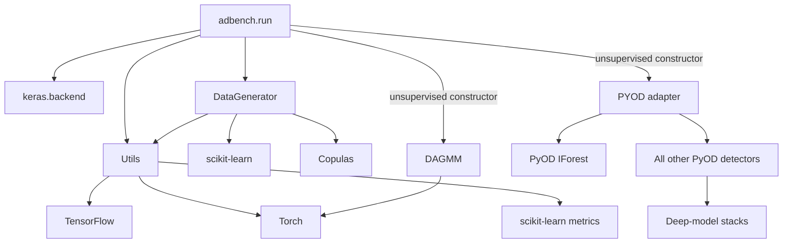
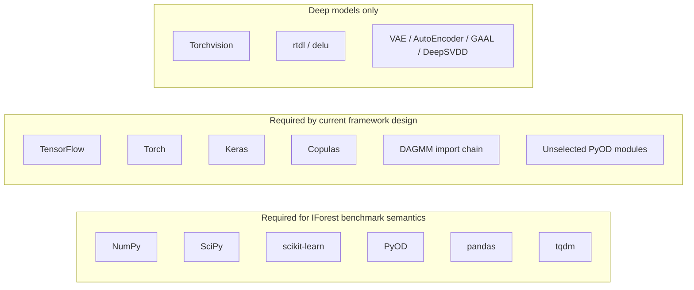

# Dependency Audit

## Dependency classes

| Class | Meaning | IForest example |
|---|---|---|
| Intrinsic | Needed by the detector algorithm or its direct numerical backend. | PyOD, NumPy, SciPy, scikit-learn. |
| Benchmark framework | Needed for shared data, orchestration, metrics, progress, or result storage. | pandas, tqdm, scikit-learn preprocessing and metrics. |
| Framework overhead | Imported or executed because shared modules are coupled to unrelated functionality. | TensorFlow, Torch, Keras, Copulas, DAGMM, unrelated PyOD detector modules. |
| Deep-model only | Provides neural networks, optimizers, data loaders, or deep architectures. | TensorFlow/Keras, Torch/Torchvision, rtdl, delu. |
| Optional feature | Supports workflows not used in an ordinary IForest experiment. | Copulas for dependency anomalies; download and plotting packages. |

`requirements.txt` pins only `pyod==1.0.0`. Other declared packages are unpinned. Several directly imported packages, including NumPy, pandas, SciPy, matplotlib, requests, Torchvision, NetworkX, Seaborn, and Click, are not declared directly.

## Import graph



## Dependency graph



TensorFlow and Torch are not intrinsic IForest dependencies, but `Utils.set_seed()` currently calls both frameworks. Keras is not intrinsic, but `RunPipeline.model_fit()` unconditionally calls `K.clear_session()`.

## Module dependency tree

```text
adbench.run
├── DataGenerator
│   ├── scikit-learn split/scaling/mixture
│   ├── Copulas
│   └── Utils
│       ├── TensorFlow and Torch seeding
│       ├── scikit-learn metrics
│       ├── download dependencies
│       └── plotting/statistical dependencies
├── Keras backend
└── unsupervised model registry
    ├── PYOD
    │   ├── IForest
    │   ├── other shallow detectors
    │   ├── deep detectors
    │   └── XGBOD
    └── DAGMM
        └── Torch training and evaluation modules
```

## Current eager imports

- Importing `adbench.run` imports Keras, `DataGenerator`, and `Utils`.
- Importing `DataGenerator` imports Copulas even when synthetic dependency anomalies are disabled.
- Importing `Utils` imports TensorFlow, Torch, download packages, plotting packages, and SciPy statistics.
- Constructing an unsupervised pipeline imports both `PYOD` and DAGMM.
- Importing `PYOD` imports every supported PyOD detector, including deep and XGBoost-backed models.

## Potential lazy-import opportunities

These are audit findings, not implemented changes:

- Resolve only the selected PyOD detector class.
- Import DAGMM only when DAGMM is selected.
- Load Keras only for models that require session cleanup.
- Load Copulas only for dependency-anomaly generation.
- Load download, plotting, and statistical packages inside their corresponding utility methods.
- Seed TensorFlow and Torch only when the selected detector uses those frameworks, subject to an explicit reproducibility policy.

The last item is not a mechanical import change: it changes global framework-seeding side effects and therefore needs targeted regression tests.

## Verified environment compatibility findings

The reproducible package lock, setup commands, import checks, and smoke-test results are authoritative in [SETUP.md](../SETUP.md). The findings below explain why several non-obvious versions are retained; they do not broaden the set of verified detectors.

| Component | Compatibility finding |
|---|---|
| Python | Python 3.10.11 completed the verified imports and smoke test. Repository metadata lists Python 3.7-3.9 classifiers but does not declare `python_requires`, so 3.10.11 is an observed compatibility result rather than a metadata guarantee. |
| PyOD / scikit-learn | PyOD 1.0.0 imports the private `sklearn.utils.fixes._joblib_parallel_args`. scikit-learn 1.1.3 and 1.7.2 did not provide the required path; 1.0.2 was verified. |
| TensorFlow / Keras | The verified stack is `tensorflow-cpu==2.15.1`, its Windows `tensorflow-intel==2.15.1` implementation, and `keras==2.15.0`. A TensorFlow 2.21 attempt left an incompatible partial installation and required newer Keras, `ml-dtypes`, and Protobuf versions. |
| Torch | Torch 2.13.0 intermittently failed to initialize `c10.dll` with `WinError 1114`; Torch 2.2.2 was reliable on the verified host. |
| Combo | `combo==0.1.3` is framework overhead required because the PyOD adapter eagerly imports the combination module, even for Isolation Forest. |

The verified environment lives outside the repository at `C:\Users\Admin\.venvs\adbench-smoke-py310`. It includes transitive dependencies to make resolution reproducible. Only the documented Isolation Forest path was smoke-tested; deep, semi-supervised, supervised, and optional baselines remain unverified.
