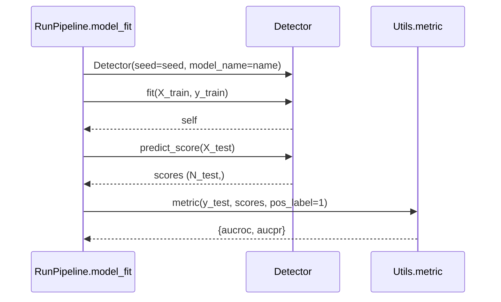

# Detector Contract

## Required interface

`RunPipeline.model_fit()` expects a detector class with the following public surface:

```python
class Detector:
    def __init__(self, seed: int, model_name: str | None = None):
        ...

    def fit(self, X_train, y_train):
        ...
        return self

    def predict_score(self, X):
        ...
        return scores
```

The pipeline uses keyword arguments for construction and fitting. Detector implementations must therefore accept the shown parameter names unless a corresponding pipeline branch explicitly provides a different signature.

## Contract details

| Element | Requirement |
|---|---|
| Constructor input | `seed` is an integer experiment seed; `model_name` is the registered model name or `"Customized"`. |
| Constructor output | A detector instance. Model initialization may occur here or in `fit()`. |
| `fit()` input | `X_train` has shape `(N_train, D)` and `y_train` has shape `(N_train,)`. |
| `fit()` output | The fitted detector instance (`self`). |
| `predict_score()` input | A feature matrix with shape `(M, D)`, normally `X_test`. |
| `predict_score()` output | A numeric one-dimensional array-like object with shape `(M,)`. |
| Score convention | Larger values mean more anomalous. Scores need not be calibrated probabilities. |
| Labels | Unsupervised detectors should not use `y_train` as ground truth. Semi-supervised and supervised detectors may use labels according to their category. |
| Randomness | The detector must honor `seed` for its own stochastic components. Shared seeding alone is insufficient when an estimator accepts an explicit random-state argument. |
| Errors | Invalid shapes, unsupported data, and fitting failures should raise informative exceptions; the pipeline converts execution failures to missing metrics. |

Binary labels use `0` for normal and `1` for anomaly. In an unsupervised experiment, true anomalies may remain in `X_train`, while unavailable anomaly labels are masked to zero in `y_train`.

## Lifecycle



Fitting time covers only the `fit()` call. Inference time covers only `predict_score()`. Constructor time, dataset preparation, metric calculation, CSV writing, and cleanup are excluded.

## Existing examples

`adbench/baseline/PyOD.py` wraps multiple PyOD estimators behind one `PYOD` class. Its `predict_score()` delegates to PyOD's `decision_function()`.

`adbench/baseline/Customized/run.py` demonstrates the external-detector contract with Logistic Regression. Its optional `model.py` and `fit.py` separation is organizational, not required by `RunPipeline`.

## New detector integration point

KLIM is not implemented. When design and implementation are authorized, its benchmark-facing adapter belongs under:

```text
adbench/baseline/KLIM/
├── __init__.py
├── run.py       # required adapter class
├── model.py     # optional model definition
└── fit.py       # optional training helper
```

Two integration modes are available:

1. Pass its adapter class through `RunPipeline.run(clf=...)`; this requires no permanent detector registration but results use the `Customized` column.
2. Register the class under the appropriate supervision category in `RunPipeline.model_dict`; this gives it a stable built-in model name but modifies central orchestration and requires explicit justification.

Before either integration, KLIM's supervision category, label policy, score orientation, reproducibility behavior, and input constraints must be documented and tested against this contract.
