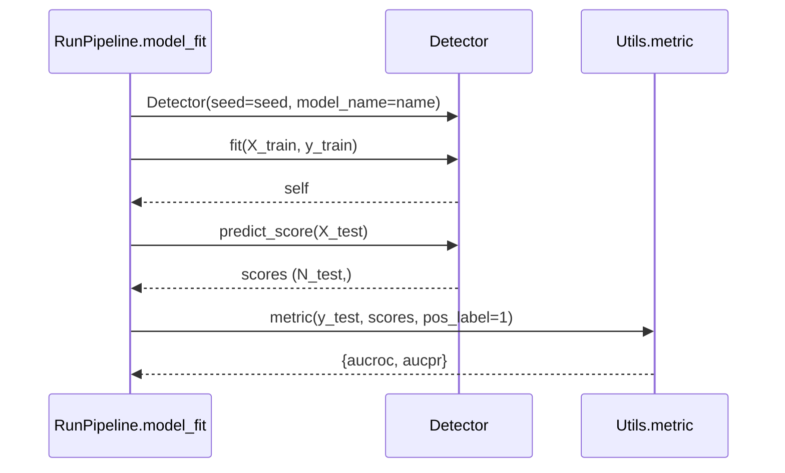

# Detector Contract

## Required interface

`RunPipeline.model_fit()` expects:

```python
class Detector:
    def __init__(self, seed: int, model_name: str | None = None):
        ...

    def fit(self, X_train, y_train):
        return self

    def predict_score(self, X_test):
        return scores
```

The pipeline constructs and fits detectors with keyword arguments, so adapters must preserve these parameter names.

| Element | Requirement |
|---|---|
| Constructor | Preserve the integer experiment `seed`; accept `model_name`. |
| Training input | `X_train:(N_train,D)`, `y_train:(N_train,)`. |
| Training output | The fitted detector instance. |
| Score input | `X_test:(M,D)`. |
| Score output | Finite numeric values `(M,)`; larger means more anomalous. |
| Labels | Unsupervised detectors must not use masked `y_train` as ground truth. |
| Randomness | Pass `seed` to detector-owned stochastic components. |
| Errors | Invalid inputs and fit failures raise informative exceptions. |

In unsupervised ADBench runs, hidden anomalies can remain in `X_train` while their unavailable labels are masked to zero. Fitting time covers `fit()` and inference time covers `predict_score()`; dataset work, metrics, persistence, and cleanup are outside those calls.

## Lifecycle



## Existing examples

`adbench/baseline/PyOD.py` wraps PyOD estimators behind the `PYOD` adapter. `adbench/baseline/Customized/run.py` demonstrates the external-detector contract; its optional internal module split is organizational rather than required by `RunPipeline`.

## NFST adapter

The standalone detector and thin adapter live under:

```text
adbench/baseline/NFST/
|-- __init__.py
|-- run.py
|-- model.py
|-- anchor_mapping.py
|-- scatter.py
|-- solver.py
`-- scoring.py
```

`NFST.fit(X_train, y_train)` ignores `y_train` and delegates all supplied training rows to `NFSTModel.fit`. `NFST.predict_score(X_test)` delegates without refitting. The adapter honors the seed and returns nearest-base-point squared distances.

NFST is intentionally not registered in `RunPipeline`. A later authorized integration may pass it as a custom detector or add it to the appropriate central category, with corresponding smoke tests. No central registration is part of the standalone implementation.
