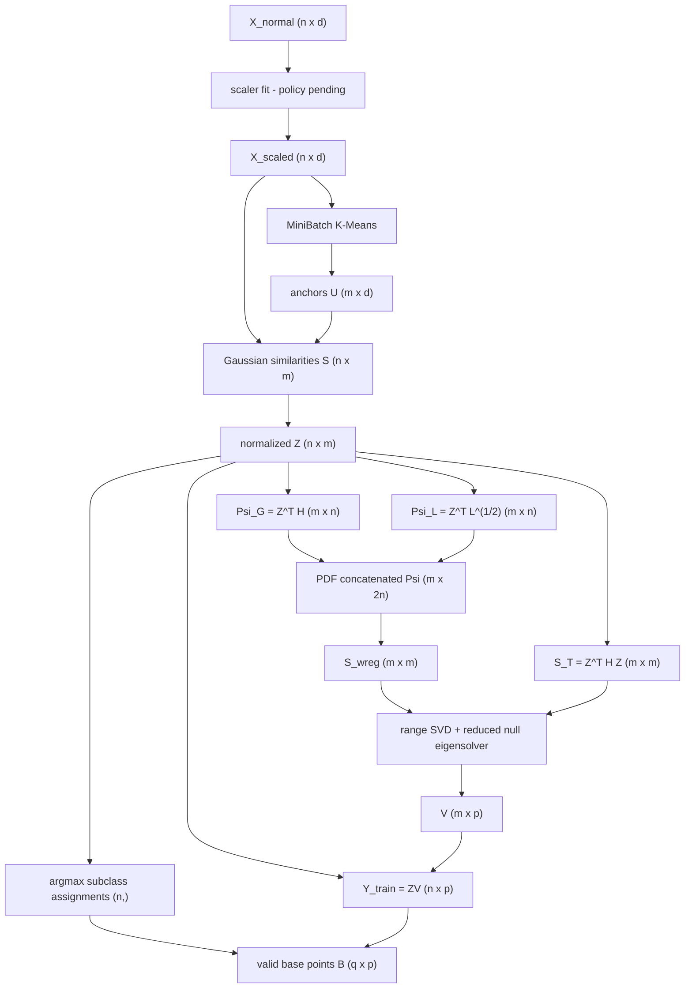
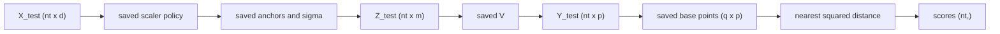
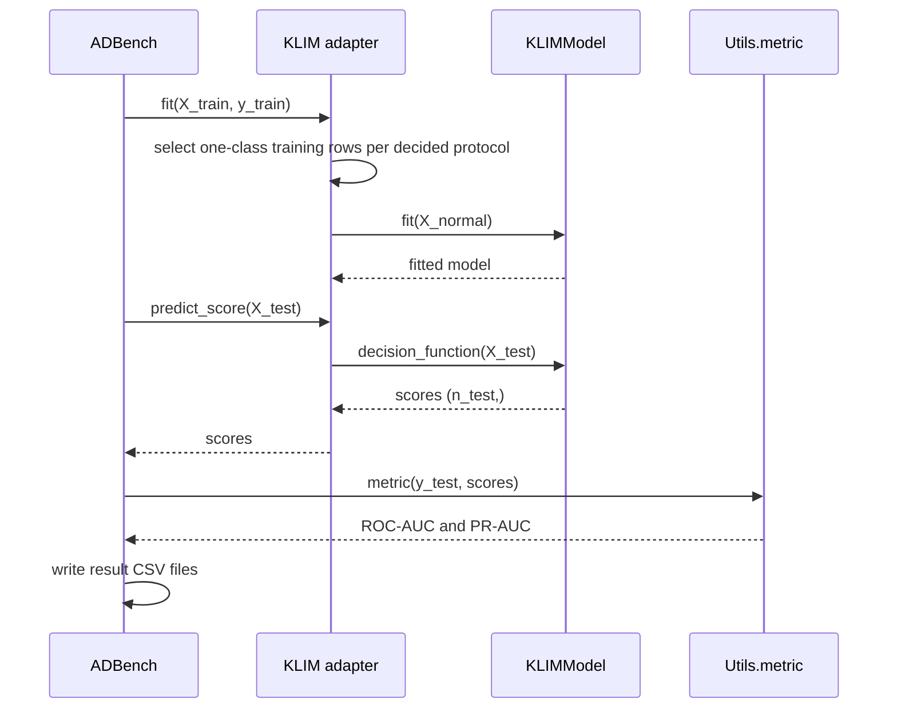

# KLIM Workflow

This document summarizes the data flow. Mathematical authority and unresolved choices are in [klim_algorithm_spec.md](klim_algorithm_spec.md).

## Problem overview

KLIM maps normal training data into a normalized anchor space, finds an NFST null subspace that balances global compactness and local graph structure, builds pseudo-subclass centroids, and scores test samples by squared distance to the nearest valid centroid.

## Training workflow

The diagram follows the PDF. The signed-error and generalized-eigen alternatives requested elsewhere remain unresolved and are not represented as KLIM source formulas.

## Inference workflow

Prediction validates feature count and finiteness, then reuses every fitted component. It performs no fitting or state mutation.

## ADBench integration

## Matrix shapes

| Object | Shape | Created during | Retained |
|---|---:|---|---|
| `X_normal`, `X_scaled` | `(n,d)` | fit | no |
| `U` | `(m,d)` | fit | yes |
| `S`, `Z` | `(n,m)` | fit | no, unless diagnostic |
| `H`, `W`, `D`, `L` | `(n,n)` | fit | no |
| `Psi_G`, `Psi_L` | `(m,n)` | fit | no |
| PDF `Psi` | `(m,2n)` | fit | no |
| `S_wreg`, `S_T` | `(m,m)` | fit | diagnostic optional |
| `Q` | `(m,r)` | fit | diagnostic optional |
| `V` | `(m,p)` | fit | yes |
| assignments | `(n,)` | fit | diagnostic optional |
| `Y_train` | `(n,p)` | fit | no |
| `B` | `(q,p)` | fit | yes |
| `Z_test` | `(n_t,m)` | predict | no |
| `Y_test` | `(n_t,p)` | predict | no |
| scores | `(n_t,)` | predict | returned |

## Fitted state

| State | Used during prediction |
|---|---|
| `scaler_` or explicit no-scaler policy | Validate/reproduce training scaling. |
| `anchors_`, `sigma_` | Produce `Z_test`. |
| `projection_` | Produce `Y_test`. |
| `valid_cluster_ids_`, `base_points_` | Calculate nearest-centroid distance. |
| `n_features_in_`, `is_fitted_` | Guard API usage. |
| `eigenvalues_`, `diagnostics_` | Audit fit; not required for scores. |

