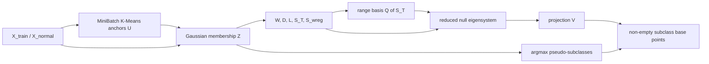
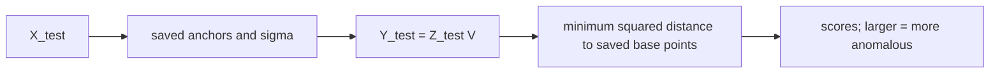
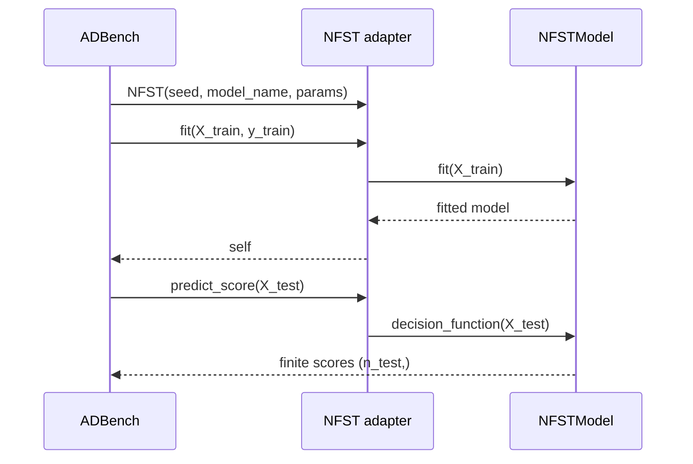

# NFST Workflow

This is the operational view of the source-defined flow. Mathematical details are in [nfst_algorithm_spec.md](nfst_algorithm_spec.md).

## Training

`NFSTModel.fit` commits anchors, resolved sigma, projection, spectra, diagnostics, valid subclass IDs, and base points only after the whole pipeline succeeds.

## Inference

Inference is batched and never refits anchors, bandwidth, projection, subclasses, or base points.

## ADBench boundary

NFST is registered as a first-class detector only in `RunPipeline`'s unsupervised registry. The adapter ignores `y_train`, because unsupervised ADBench labels may be masked, and fits every supplied `X_train` row under a contaminated one-class protocol. ADBench remains responsible for splitting, training-fitted MinMax scaling, metric calculation, timing, and CSV persistence.

The focused integration check is `scripts/smoke_test_nfst.py`. It replaces the instantiated pipeline's registry with exactly one model at a time, first NFST and then IForest, so it does not execute the full unsupervised baseline collection. Current verified metrics and commands are recorded in [implementation_status.md](implementation_status.md).

## First real-dataset execution

`scripts/benchmark_nfst_one_dataset.py` fixes one local classical dataset (`6_cardio.npz`), checks dense-graph memory before fitting, and runs isolated NFST and IForest registries on identical seed-1/2/3 splits. It records split fingerprints, per-seed diagnostics, metrics, timing, failures, and all four standard CSV types.

The first execution failed for NFST at the reduced projection problem because numerical nullity was zero for every seed under the predeclared `sigma=None`, `alpha=0.5`, and `null_tolerance=1e-8` configuration. No score was produced and no parameter was changed after the failure. IForest completed normally on the same splits. See [implementation_status.md](implementation_status.md#step-9---first-real-dataset-benchmark) for the preserved evidence and next-step constraint.

The practical recovery keeps strict-null mode as the default but allows an explicit `selection_mode="smallest"` branch with a required component count. Cardio was rerun with two smallest reduced eigenvectors selected from a seven-dimensional reduced space. All three runs completed with finite scores, while diagnostics continued to report exact nullity zero so the variant cannot be confused with source-strict NFST. This low-eigen path is opt-in and must be named in benchmark reports.
