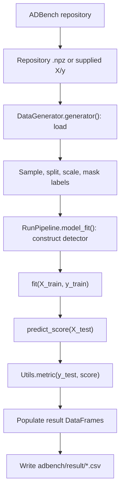

# Execution Workflow

## End-to-end flow



## 1. Experiment construction

`RunPipeline.__init__()` selects one supervision category and builds its model registry. It defines labeled-anomaly settings, three experiment seeds, optional corruption parameters, and the output suffix.

`RunPipeline.run()` obtains the repository dataset list or accepts a dictionary containing `X` and `y`. It forms the Cartesian product of dataset, label-availability, noise, and seed settings. Unsupervised execution retains only the zero-labeled-anomaly setting.

## 2. Dataset loading

`DataGenerator.generator()` loads arrays from:

- `datasets/Classical/`;
- `datasets/CV_by_ResNet18/`;
- `datasets/NLP_by_BERT/`;
- or caller-supplied `X` and `y`.

Input features have shape `(N,D)` and labels have shape `(N,)`. Dataset files must expose `X` and `y` keys.

## 3. Sampling and optional transformations

Depending on configuration, the generator may:

- resample small datasets to `n_samples_threshold`;
- subsample datasets larger than 10,000 rows;
- generate a selected realistic synthetic anomaly type;
- add the configured robustness noise.

These operations preserve aligned feature and label rows.

## 4. Split and preprocessing

The generator performs a shuffled, stratified train/test split with its configured `test_size` (default `0.3`). No explicit `random_state` is passed to `train_test_split`; the process relies on the NumPy global seed.

`MinMaxScaler` is fitted on `X_train` and transforms both feature partitions. The test set is not used to fit the scaler.

Training anomalies are partitioned into labeled and unlabeled groups. Unavailable anomaly labels are rewritten to zero in `y_train`. Ground-truth `y_test` is preserved for evaluation.

The generator returns:

```text
X_train: (N_train, D)
y_train: (N_train,)
X_test:  (N_test, D)
y_test:  (N_test,)
```

## 5. Random seeds

`DataGenerator.generator()` calls `Utils.set_seed()` before data operations. Detector adapters such as `PYOD.fit()` call it again before fitting. The utility seeds Python's `random`, NumPy, TensorFlow, and Torch and configures deterministic CuDNN flags.

Individual detectors should still pass the provided seed to estimator-specific random-state parameters when available.

## 6. Detector initialization and fitting

`RunPipeline.model_fit()` constructs the selected class using `seed` and `model_name`. It then calls:

```python
detector.fit(X_train=X_train, y_train=y_train)
```

The fitting timer starts immediately before this call and stops immediately after it. Constructor and preprocessing time are excluded.

## 7. Inference

For ordinary detectors, the pipeline calls:

```python
score_test = detector.predict_score(X_test)
```

DAGMM has a separate two-matrix call. The inference timer surrounds only `predict_score()`. The expected ordinary output is a numeric `(N_test,)` vector whose larger values indicate stronger anomalies.

## 8. Metrics

`Utils.metric()` evaluates `score_test` against untouched `y_test`. It returns scalar ROC-AUC and average precision under the keys `aucroc` and `aucpr`. Metric-calculation time is not included in inference time.

## 9. Cleanup and failures

After successful evaluation, `RunPipeline.model_fit()` clears the Keras session, deletes the detector reference, and invokes garbage collection. Initialization and execution failures are caught; fitting failures produce missing metric values and `None` timing values.

## 10. Result persistence

`RunPipeline.run()` stores metrics and times in four pandas DataFrames. It writes them after every completed model iteration to:

```text
adbench/result/AUCROC_<suffix>.csv
adbench/result/AUCPR_<suffix>.csv
adbench/result/Time(fit)_<suffix>.csv
adbench/result/Time(inference)_<suffix>.csv
```

CSV-writing time is outside fitting and inference measurements. The method returns a list containing experiment parameters, model names, metric dictionaries, and timing values.
